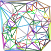

## Delaunay Triangulation

Rust implementation of this [c++ Code](https://github.com/Bl4ckb0ne/delaunay-triangulation)

### Sample

At the moment the main just genereates 100 random points and builds a triangle mesh.
An image is than drawn with all the triangles(maybe use a better drawing library :)):

